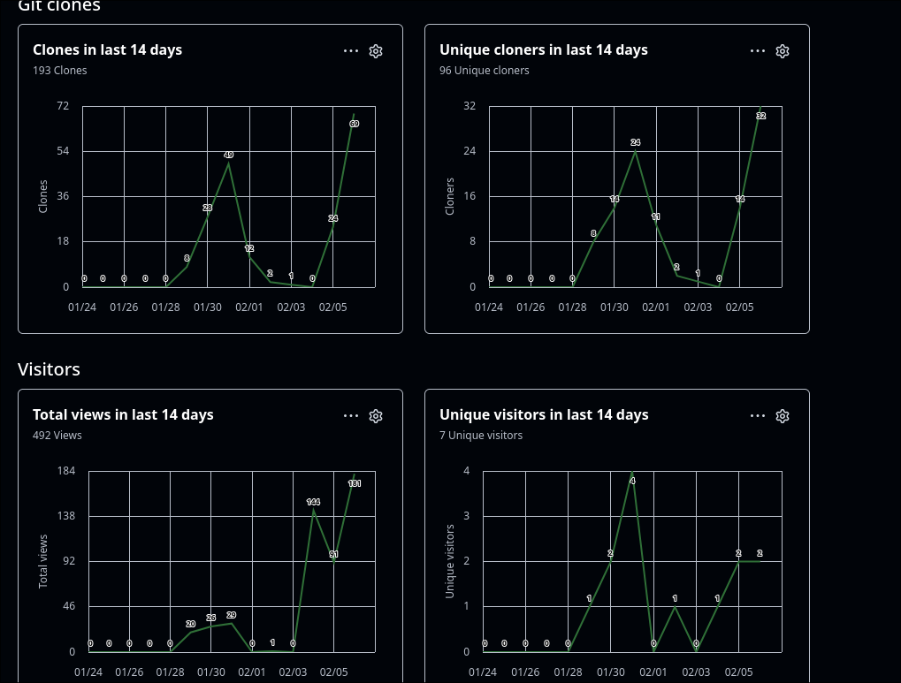

# CHANGE-LOG/Dev-Log

The changelog is actually a dev log suckas

## Dev-Log
--- 
### day 1
im starting the Dev log on jan. 29 2026. just to clarify, this is NOT when i started the game. it started in early 2025, but ive been slapped around.

Who is this for? me...presumably. as i expect no one else to see this. // THIS IS A LIE. I plan to show ts off after im done.

Things i plan to do: Refix REP/modules/Casino/Tokenizer, Redo slots, and start on Shop...hopefully.

okay writing this on the day AFTER...freak that. i basically just finished the tokenizer...a shame

---
### day 2
Jan 30, 2026. after yesterdays...progress today i will only plan to finish the text in the tokenizer, then push to start slots. maybe today will be hold more progress then yesterday. 

**1:06**: turns out there was a bug in save_stuff.py. fixed it. also i am trying to make sure when switching areas it feels smooth and not cluttered. tokens is ALMOST done. a few more lines of time.sleep(), some testing, repeat till its done.

**2:23**: i changed the name of Saves to Save_Modules to stop confusion between saves and Saves (Both Dir), now the only thing its Save_Modules and save_module is a thing. capital different and one is a Dir while the other is a file. also finished with the tokenizer. next step: SLOTS!! 

**2:31**: WHAT HAVE I DONT. It's Alive. wtf
    .
    .
    .
    JOKING. im wasting more time. :)

**4:14** im geting back to work. read alot of homestuck :)  Time to start on slots again. 

**4:50** slots animation is done. im gonna set up the function in Casino.py, then push it to github, then bug test.

**5:40** Slots is done. untested, but done. 

Day 2 is done. :]

---
### day 3
Jan 31 2026. yesterday went according to plan. today the plan is to finish slots/bugtest and add scripting, set up save/quit, saves in Casino, and then afterwards if i have energy add the dev console.
I think today can have lots of things since all the said things are quite small. save quit is a simple prompt and check. scripting is write it in lore.json, add the lines to the slots function in Casino.py, then import save, make sure the save slot is in Casino.py, then add saves throughout Casino.py. simple.

**12:46** Slots is done, with a few tweaks to the Token store timing wise, and a few clear()s. feels good to be caught up. sent the executable in a zip file to the QA        members in hopes they find bugs i can fix. and if they can't then we are golden. :)

**1: 09** I've decided after my short break to start on the save/quit function

**3:14** OMG. just ran into so many syntax errors in the save quit function. also turns out pyinstaller isnt good at reporting errors :(. but it works, and a svae quit function exists.

**4:37** dev console in progress. im done for today. im tired. the save/quit thing killed my momentum. dev console WILL be finished tomorrow. i will make sure of it. 

noticable less action then yesterday, but simple how it is i guess. and progress IS progress. :)

---
### day 4
Feb 01, 2026. with the most recent progress, and the making of Static, i do believe today will hold plenty of progress. The Plans for today is to finish the Dev console, and start on the shop. i do think the shop will take tomorrow to finish with the scale of it, but it should be super good...while writing that ive decided to also work on the inventory with the shop. this way i can see whats happening :).

---
### day 5
Feb 05, 2026. i have made little progress as of day 4. as in i did a small thing to the dev console, and took a long break.
so plan for today is ACTUALLY FINISH THE DEV CONSOLE!! Thank you :)

Have me some dr thunder, i am READYYY

**11:53** I have fixed roulette...again. now there is a way to leave lol. and also Dev console is DONE. on to the Shop/inventory, im hyped :)
      I will be starting With the inventory, just cause =_=

**7:39** I am done for today. inventory module started as a class. 

---
### day 6
Feb 06, 2026. Inventory work, and adding comments and notes in dev_stuff is on the agenda. 
I adjusted the repo structure to be more clear and readable to newbies, and just anyone in general.
Yesterday i added CONTRIBUTING and requirements so people can help debug.

---
### day 7
Feb 7, 2026. okay, i was wrong. yesterday (the 6th) was just be making sure everything else was smooth. the repo, the discord server, etc. other then that not much happened other then more comments. with all that done it IS inventory time.

**12:37** After getting the basic display of the inventory working, im quite excited for it. imo its gonna be the most interactive thing i built so far. :))
    prolly the most interactive too.

also i wanna talk about how the REPO for REstate+ is getting so many views...

I never thought something i made would get this kind of attention, bots or not.

**1:57** Made the icon and updated README with appropriate information.

**3:22** fully fleshed out inventory structure, with good timing and formatting. starting on the shop

**3:45** im stalling again, the save_stuff has been updated, preparing for shop and other things. really dont wanna go and do this. so many items. but it has gotta be done. i guess first step is doing shop item replicas.

**5:19** made the shop folder+file, and have been upgrading the current savefiles to make room for the shop. kinda brain numbing, but will be worth it.

---
### day 8
Feb 8, 2026. some decent progress happened yesterday. i dont expect as much, but i have plans >:), though the shop still scares me. i dont know how im gonna improve it compared to the last one. i mean other then more items, and obv actually getting sales to work. i mean, i guess just making it have a better UI too. which is also the plan. i guess casheer dialogue would work. but i'd like to implement that with the other NPCs.

**8:27** i have done zero progress and its 8pm. ive started on the shop :)

**10:30** Shop has had decent progress. :)

---
### day 9
you'll never guess it, but its Feb 9, 2026. Shop has had LARGE progress. its missing checks and the buying mechanic, Also i've decided to add more detail to the dev log. :). 

---
### day 10
Feb 11, 2026. took a few days off, decided to take today to fix a few bugs and edge cases, as well as more comments around the place so future me can figure out what any of this means. Im a little disapointed i didn't do too much on day 9, even after saying i'd put more details into the dev logs and not even doing anything that day. but hey who cares. Im here now.

**2:34** Added comments to shop, specificly shop function. shop_init is a bunch of print statements and match case statements that are quite simple. Starting work on commenting Hub.py

**2:51** all but kasino has comments. i do mean ALL but casino has comments...well i guess save_stuff doesnt? but why does it need comments. the dict/key names should be enough to tell me whats happening. while i add comments to kasino.py (or whatever its named) i'll fix some edge cases with the slots function and whatever else.

**3:05** Finished comments, add checks and continues to slots for the two missing edge cases. Need to do print statements for this when i get to them. onto finishing the shop :), which is adding dialogue, as well as checks and actually being able to buy stuff.

---
### day 11
Feb 13 2026, skipped yesterday. todays plan is to actually finish the shop, including: item display logic, buying checks and monkey wrenching, and setting up inventory display logic/checks for the new items. i predict i get shop done, and inventory update started but not finished.

**12:19** Started on shop item display logic. it should be simple, get item and item description parameters, then print item, price, and desc on one page, the have a "buy return" input. while the function exists it has a place holder print line cause i'd like to add shop script to lore.json real quick.

---
### day 12
Feb 14 2026. I am sorry for being so absent. REP has been a bit draining, and ive been less productive. as of now the shop has a script, clear lines, and line buffers. 

---
### day 13
Feb 18 2026. Holy Sh17. Another OS switch. Arch betrayed me and i couldnt no more, so im on Ubuntu now. Lack of work mainly cause Depression and some burn out. :\ . im hoping to get back into the flow. also after doing some research, the genre of text games are so dang boreing. mostly dundeon crawlers. also most "modern text based games", use images now. talk about betraying the medium. I think i can mix things up a bit, and i have some ideas for a...text based game, after REstate Plus. 
The reason i havent been working on REP, or even documenting it much is cause the burn out. ive been trying, but its hard, so i stopped trying for a moment. and here we are! i feel better, and i have plans. big plans >:D

---
### day 14
Feb 19 2026. second week of dev log, plans for today include: finishing shop item display, and actual functionality, slot edge cases get print statements, inventory gets edge cases (even if just place holders). switch charged, headphones charged. music is ready. most chores out of the way. I am ready.

**10:22** Item display is complete, sales are also now obvious. it went my faster then i though. now its time for item purchase logic. im kinda scared of it, cause the amount of if checks...:\ . but we should be fine. hopefully.

**3:09** i have played with generate doc string. it is kinda lame. :|. i havent been very productive as there are people over. and its distracting. also i have a cool chair now.

**3:26** changed the intro key in save_stuff. when ever i ask an ai to rate the code base, its always one of the complaints. "its comparing it to false, but its a string", SO now its a boolean. which sure i guess. sure :\. It has been pointed our to me the timing uses magic numbers. to avoid this ive decided to add a global.json and use that for settings. as of now it will only hold timing. 

---
### Day 15
Feb 21 2026. Did some cooler formatting for the markdown :) I think i'll have to code during weekends. most days i just done have the energy for it. but it IS a saturday; meaning i could code. 
Also gonna start using checkboxes

- [ ] Shop buying logic and item owning in inventory
- [ ] update inventory logig with items
- [ ] Make sure shop has phases and lock checks.
- [x] Finish implementing Global.json

(i still update this ^, :))

---
### Day 16
Feb 26 2026. Wow i suck at this. lol. well the plan is not to touch the shop today, finish everything else ive started: Edgecases everywhere. Finish adding the global timings. thats it. also ive decided to implement Cython for the sake of speed. why does a not resource intensive game, working as fast as it does need speed? because python is considered bad cause its slow. and i want to hyper-optimize. Cython brings C like speed to python. :)). between 3.14, and Cython, and gc.collect? this game is gonna run so smoothly.

**8:42** global logic is finished in Hub, and shop.

**4:14** been gone a second for GED classes, finished global timing in all but SaveExit. also did research on Cython. the plan is to change all functions and classes to cpdef objects. and moving the shop dict from save files to the save module, edit it so its a top layer for the cdef struct! aka OPTIMIZATION!!!! but first, finish implementing edge cases.

---
### day 17
Feb 27 2026. Progress i guess. turns out Cython wont work. kinda dissapointing. i had plans to heavily optimize the game, but oh well. only so much you can do lol. plans for today have been the plans for the last few days, finish the shop, which ive been heavily procrastinating on lol.

**3:35** Shop dict is IN the shop, save files have the item booleans :). it is time to wrap up the shop ive been avoiding for a while for some reason.

**4:31** BLEH i hate bugs. got it though. The shop would use the last items desc in the respective page via desc being set. now i just use the shop dict directly. break time...it killed my momentum.