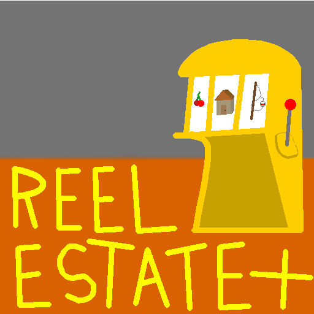

## License

This project is licensed under the GNU General Public License v3.0.

You are free to use, modify, and distribute this code under the same license.
All contributions must retain this license.

## What is Reel Estate+
This is Reel Estate+, Reel Estate was my first *real* coding project, based off of a stream bots gambling command. since then Reel Estate has evolved, and its time to modulize it, and give it color(colorama).

Reel Estate features:
* Gambleing
    * slots
    * roulette
* fishing
* a shop
* COLOR(Reel Estate+ feature)
* achievments
* npcs and side quests
* collectables
* and more, especially with this new version!

## Structure

The game modules can be found in the REP/ folder.

**REP** - REP/ is split into three main folders, constants/ which holds all the dialogue, save data, and other text based thing used cross session, core/ whic has all the main major things, such as the menu, and main game look, and Modules/ which has just about everything else such as Casino/ or Misc/.

**LEGACY** - LEGACY/ has Reel_Estate_8.1 which was the lastest version of the orginal Reel Estate, It is here as a blue print.

**/** - The root folder has all the github info, requirements.txt, REP/, and LEGACY/. setup.py was to make pyinstaller work, same with ReelEstateplus.egg-info.     

## Other information

You can find more info in the wiki at github.com/sepforBlueBoi/ReelEstatePlus/wiki
, the Change log that acts as my dev log, and CONTRIBUTING.

## Sick game information && Pictures

REstate may be text based, but still has animations, such as roulette, and slots!

The name Reel Estate was made by a user on twitch going by avoidingcord366.

